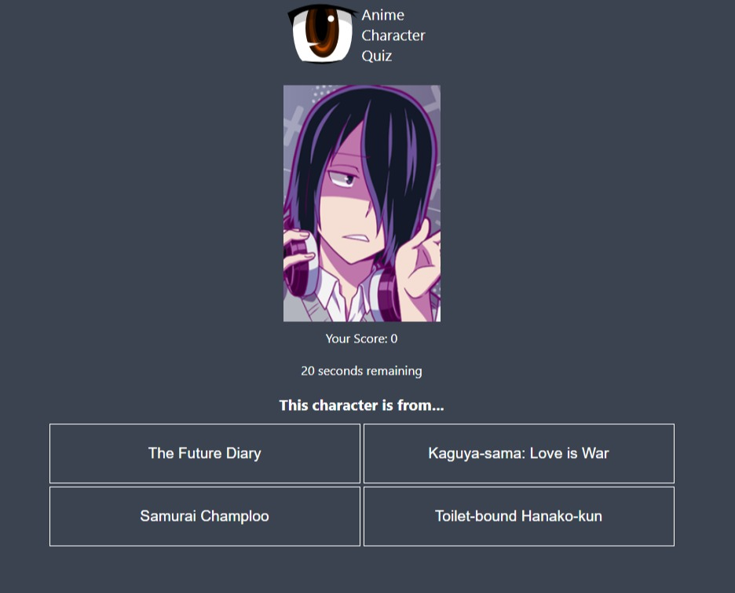

[](https://app.netlify.com/sites/anime-character-quiz/deploys)

<p align="center">
  <a href="https://github.com/AjayLiu/anime-character-quiz">
    
  </a>

  <h3 align="center">Anime Character Quiz</h3>

  <p align="center">
    A simple game where an image of a random popular anime character is shown, which you have to identify which anime they're from!
    <br />
    <a href="https://anime-character-quiz.ajayliu.com"><strong>Website »</strong></a>
</p>

<!-- TABLE OF CONTENTS -->
<details open="open">
  <summary>Table of Contents</summary>
  <ol>
    <li>
      <a href="#about-the-project">About The Project</a>
      <ul>
        <li><a href="#built-with">Built With</a></li>
      </ul>
    </li>
    <li>
      <a href="#getting-started">Getting Started</a>
      <ul>
        <li><a href="#prerequisites">Prerequisites</a></li>
        <li><a href="#installation">Installation</a></li>
        <li><a href="#development">Development</a></li>
        <li><a href="#deployment">Deployment</a></li>
      </ul>
    </li>
    <li><a href="#license">License</a></li>
    <li><a href="#contact">Contact</a></li>
    <li><a href="#acknowledgements">Acknowledgements</a></li>
  </ol>
</details>


<!-- ABOUT THE PROJECT -->
## About The Project

</img>

The 250 most popular animes are fetched from Anilist, where their 5 most popular characters are added to the quiz pool. Then they are randomly picked in the quiz.

### Built With
* [Gatsby.js](https://www.gatsbyjs.com/)
* [Anilist API](https://anilist.gitbook.io/anilist-apiv2-docs/)
* [React](https://reactjs.org/)
* [SCSS](https://sass-lang.com/)
* [Netlify](https://www.netlify.com/)


<!-- GETTING STARTED -->
## Getting Started

Here is a guide if you want to clone my website and modify it for yourself, all the way to deployment.

### Prerequisites

* [yarn](https://yarnpkg.com/)
* [git](https://git-scm.com/)

### Installation

1. Clone the repo
   ```sh
   git clone https://github.com/AjayLiu/anime-character-quiz.git
   ```
2. Install packages
   ```sh
   yarn
   ```

### Development

To run the development server
   ```sh
   yarn dev
   ```
   
### Deployment
1. Publish the site on Netlify using continuous git integration. :tada:

<!-- LICENSE -->
## License

Distributed under the MIT License. See `LICENSE` for more information.


<!-- CONTACT -->
## Contact

Ajay Liu - contact@ajayliu.com

Project Link: [https://github.com/AjayLiu/anime-character-quiz](https://github.com/AjayLiu/anime-character-quiz)


<!-- ACKNOWLEDGEMENTS -->
## Acknowledgements
* [string-similarity](https://www.npmjs.com/package/string-similarity)
* [Netlify](https://www.netlify.com/)
